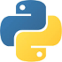
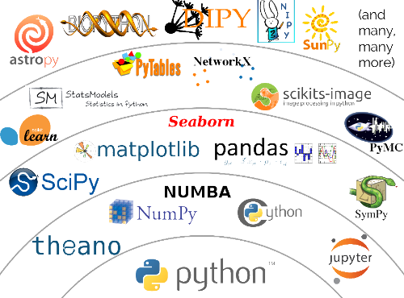

<span style="font-size:24px;">Tutorial Python.</span>

*Tutorial Python* es una guía de referencias para la instalación e introducción rápida al lenguaje [*Python*](https://www.python.org/).


 

## Desarrolladores.

* [Ing. Edgard Decena.](mailto:edecena@gmail.com)
* [Ing. Luís Acevedo.](mailto:laar19@protonmail.com)

<a name = "indice"></a>

## Índice.

<pre>
1. <a href = "#python">Python y el Cálculo Científico.</a>
2. <a href = "#instalacion">Instalación.</a>
3. <a href = "#modos">Modos de uso.</a>
4. <a href = "#caracteristicas">Características fundamentales.</a>
5. <a href = "#libros">Libros de aprendizaje.</a>
    5.1 <a href = "#python-crach-course">Python Crash Course.</a>
    5.2 <a href = "#learning-python">Learning Python.</a>
    5.3 <a href = "#fluent-python">Fluent Python.</a>
    5.4 <a href = "#learning-python-the-hard-way">Learn Python: the hard way.</a>
    5.5 <a href = "#python-cookbook">Python Cookbook.</a>
    5.6 <a href = "#python-para-todos">Python para todos.</a>
6. <a href = "#trucos">Trucos y consejos.</a>
    6.1 <a href = "#creando">Creando un entorno virtual Python.</a>
    6.2 <a href = "#estructura">Estructura de un script en Python.</a>
    6.3 <a href = "#guia">Guía de estilo PEP8.</a>
7. <a href = "#codigos">Códigos Python.</a>
    7.1 <a href = "https://github.com/ejdecena/tutorial_python/blob/master/codigos/hola_mundo.py">Hola Mundo Python!</a>
</pre>

<a name = "python"></a>

## 1. Python y el Cálculo Científico.

Históricamente la ciencia se ha dividido en **disciplinas experimentales** y **disciplinas teóricas** (o *empirismo* y *racionalismo*). Consecuentemente, un gran número de estudios en filosofía de la ciencia (*epistemología*) se han dedicado al estudio de la interelación de estos dos modos de hacer ciencia. Durante las últimas décadas la **computación** ha emergido como un componente importante del quehacer científico, y al hacerlo ha desestabilizado esta visión binaria de la ciencia. Dicho de una forma simple, es posible ahora usar las computadoras para resolver problemas científicos de forma más rápida y menos engorrosa; **pero sobre todo, resolver problemas que antes no podían ser resueltos analíticamente**.

Para la solución de estos problemas científicos, dentro del software libre ha surgido en los últimos años el lenguaje de programación [**Python**](https://www.python.org), que últimamente ha tenido una mejora sustancial con la inclusión de potentes y versátiles librerías de cálculo simbólico (*SymPy*), numérico (*NumPy* y *SciPy*) y gráfico (*PyPlot* y *Matplotlib*). *Python* ha tenido una vertiginosa evolución y expansión a nivel mundial, no sólo en el ámbito académico, sino también en el ámbito científico e industrial.

<a href = "#indice">[IR AL ÍNDICE]</a>

<a name = "instalacion"></a>

## 2. Instalación.

Según el sistema operativo, *Python* puede ser instalado de 3 maneras:
* **Windows**: puede ser descargado directamente desde la [página principal](https://www.python.org/downloads/windows/) de *Python*.
* **Mac OS X**: Aunque la mayoría de las versiones de *MacOsX* vienen con *Python* pre instalado, puede en algunos casos instalarse desde la [página principal](https://www.python.org/downloads/mac-osx/) de *Python*. 
* **Linux**: Todas las versiones de Linux vienen instaladas con *Python*. podrás ver la versión que tienes instalada abriendo la terminal y escribiendo `python`.

<a href = "#indice">[IR AL ÍNDICE]</a>

<a name = "modos"></a>

## 3. Modos de uso.

En *Python*, se suele usar el código de 3 modos relacionados:

* **Interactivo**: Esto es común en tareas exploratorias, cuando aún no tenemos del todo definido el problema. Por ejemplo, tenemos un conjunto de datos en uno o más archivos y necesitamos saber qué información contienen, quizás hacer algún gráfico o buscar palabras claves. Los modos interactivos de *Python* pueden habilitarse al usarlo directamente en la terminal a través del intérprete del lenguaje, mediante *Jupyter Notebooks*, compiladores online, etc.

* **Scripts**: Los scripts (del inglés guión) se refiere a pequeños programas que se usan para tareas sencillas, generalmente cuando queremos automatizar tareas como hacer una copia de respaldo (backup) semanal, o descargar alguna información de una página web cada vez que esta actualice cierta información. A veces también estos scripts se usan como "pegamento" para concatenar programas, generalmente cuando estos programas son complejos o no tenemos acceso al código fuente (o no entendemos el código fuente).

* **Paquetes o librerías**: Esto es más o menos lo que uno tiene en mente cuando piensa en un programa, como una hoja de cálculo, o una aplicación de para el celular. Es decir, son varios bloques de códigos organizados para realizar diversas tareas. En general, un usuario de *Python* NO escribe librerías, sino que hace uso de ellas. Escribir librerías requiere de ciertos principios de ingeniería de software, de lo contrario el código tendrá altas probabilidades de ser ineficiente, difícil de mantener, propenso a errores, etc.

<a href = "#indice">[IR AL ÍNDICE]</a>

<a name = "caracteristicas"></a>

## 4. Características fundamentales.

El lenguaje *Python* es:
* Un lenguaje de programación **orientado a objetos**.
* De **propósito general**, es suficientemente bueno para casi todo.
* **Multiparadigma**, es posible programar usando distintos estilos de programación o incluso combinándolos.
* De **alto nivel**, es decir cercano al lenguaje humano y lejos del lenguaje máquina.
* **Interpretado**, es decir no es necesario compilarlo antes de correr un script Python.
* **Multiplataforma**, corre en diversos sistemas operativos.
* Un lenguaje **simple**, el código es simple de leer, de escribir y de mantener.
* **Gratuito** y es una herramienta de **código abierto**.
* Está muy **bien documentado**.
* Es ampliamente usado en la mayoría de las disciplinas científicas.
* Tiene una gran comunidad de usuarios (no todos científicos), por lo que es fácil encontrar ayuda, tutoriales, foros, blogs, etc.
* Buena performance. Aunque estrictamente es un lenguaje lento (el costo de la simplicidad). Existen formas de acelerarlo.
* Posee un extenso ecosistema de librerías:

<p align = "center">
    <a href = "https://www.youtube.com/watch?v=5GlNDD7qbP4">
        
    </a>
</p>

<a href = "#indice">[IR AL ÍNDICE]</a>

<a name = "libros"></a>

## 5. Libros de aprendizaje.

*Python* es un lenguaje con una curva de aprendizaje interesante. Muchos autores han decidido volcar sus conocimientos para apoyar a los aprendices en la construcción de programas y conocimiento estructurado. Hay libros especializados en temas puntuales o en tópicos importantes; como por ejemplo el desarrollo web o el análisis de datos.

La correcta elección de un libro implica muchos factores, pero es bastante útil de primera mano buscar referencias que nos puedan dar un panorama más claro del autor o título, para así tener la seguridad antes de leer un libro sobre *Python*.

Aquí te presentamos los principales libros sobre el lenguaje, los más destacados a elección de los profesionales del sector.

<a name = "python-crach-course"></a>

### 5.1 Python Crash Course.

[*Python Crash Course*](https://www.amazon.com/Python-Crash-Course-Hands-Project-Based/dp/1593276036) es un curso sorprendente, orientado a personas que quieren aprender a programar por cuenta propia.  Es una introducción amena a la programación y particularmente, como es lógico, al lenguaje *Python*. A través del libro se tienen distintos desafíos entre los cuales destaca el escribir programas, resolver problemas y consolidar los conceptos básicos previos a código de mayor nivel.

El libro enseña conceptos bastante populares en la actualidad, como el uso de librerías, la respuesta a eventos de mouse y teclado, visualización de datos e incluso creación de juegos en 2D.

<a name = "learning-python"></a>

### 5.2 Learning Python.

[*Learning Python*](https://www.amazon.com/Learning-Python-5th-Mark-Lutz/dp/1449355730/ref=pd_lpo_sbs_14_t_2?_encoding=UTF8&psc=1&refRID=JN73FSJC7091MKHXNN8Y) es uno de los libros más populares, dado que es el resumen del curso de entrenamiento en *Python* de su autor, Mark Lutz. Es un libro que mejora constantemente, presentando una quinta edición bastante robusta que introduce conceptos y buenas prácticas.

Tiene muchas bondades, entre ellas desafíos que permiten escribir código de forma rápida, eficiente y de alta calidad. Está indicado para personas con pocos conocimientos, aunque obviamente es útil también para programadores con mayor experiencia.

De primera mano permite explorar los tipos de objeto por defecto que vienen con el lenguaje, como la sintaxis elemental. Una de sus principales características es que todos los conocimientos están orientados en la programación orientada a objetos.

<a name = "fluent-python"></a>

### 5.3 Fluent Python.

[*Fluent Python*](https://www.amazon.com/Fluent-Python-Concise-Effective-Programming/dp/1491946008/ref=sr_1_1?ie=UTF8&qid=1499089735&sr=8-1&keywords=Fluent+Python%3A+Clear%2C+Concise%2C+and+Effective+Programming) es un libro distinto, está diseñado para volverse productivo en el desarrollo con *Python* de forma rápida, dado que es un libro “hands-on” que básicamente prioriza las actividades a la teoría.

Este libro se concentra en aspectos importantes como modelos y estructuras de datos, funciones y flujos de control. Además tiene una sección muy interesante relacionada a la metaprogramación, un concepto más avanzado pero inherente a grandes proyectos.

<a name = "learning-python-the-hard-way"></a>

### 5.4 Learn Python: the hard way.

[*Learn Python: the hard way*](https://learnpythonthehardway.org/book/) es un libro que por el título puede pensarse está orientado a programadores experimentados o que buscan un desafío en su aprendizaje. Sin embargo, es un libro eminentemente para principiantes, de una elevada calidad. El término “Hard way” se refiere al deseo del autor de afianzar algunos conceptos como base para avanzar en el libro.

El libro tiene niveles iniciales con temas elementales (como el primer Hola mundo o la construcción de variables) pero poco a poco ahonda y permite tener una visión sólida del lenguaje *Python* de cara a la programación orientada a objetos.

<a name = "python-cookbook"></a>

### 5.5 Python Cookbook.

[*Python Cookbook*](https://www.amazon.com/Python-Cookbook-Third-David-Beazley/dp/1449340377/ref=sr_1_4?s=books&ie=UTF8&qid=1520398239&sr=1-4&keywords=python+cookbook) es uno de los libros más amenos para el aprendizaje de *Python*. Se puede encontrar las indicaciones para el desarrollo de programas a manera de recetas. Hay una serie de temas interesantes para desarrolladores experimentados y novatos que se pueden explorar. Entre ellos están los algoritmos y estructuras de datos, las cadenas de texto y números, los tipos de operadores, las clases y objetos, la programación web y los principales errores en el desarrollo de un programa.

<a name = "python-para-todos"></a>

### 5.6 Python para todos.

[*Python para todos*](documentos/libro_python_para_todos.pdf) se trata de un libro gratuito, que empieza tratando sobre conceptos básicos pero ahonda hasta el uso de bases de datos. Está distribuido bajo una licencia de *Creative Commons* y se puede realizar su descarga en formato PDF directamente desde su misma página web.

Estos fueron algunos títulos únicamente del gran universo bibliográfico que gira en torno a *Python*. Como hemos podido ver, la mayoría de ellos están escritos en inglés, pero inclusive si no tienes el idioma a la perfección muchos de los conceptos son entendibles.

Siéntete en la libertad de usar libros para aprender *Python* cuando desees, porque si bien es cierto que para programar se necesita escribir código a diario, un libro puede ser el aliado perfecto al momento de diagnosticar un error o resolver un bug.

<a href = "#indice">[IR AL ÍNDICE]</a>

<a name = "trucos"></a>

## 6. Trucos y consejos.

<a name = "creando"></a>

### 6.1 Creando un entorno virtual Python.

Cuando se está desarrollando software en *Python*, es común utilizar diferentes versiones de un mismo paquete. Un *virtualenv*, o entorno virtual de *Python*, es un ambiente creado con el objetivo de aislar recursos como librerías y entornos de ejecución del sistema principal o de otros entornos virtuales. Esto significa que en el mismo sistema, computadora, es posible tener instaladas múltiples versiones de una misma librería sin crear ningún tipo de conflicto.

Para crear y utilizar un entorno virtual debe instalarse `virtualenv`; pero antes debe instalarse el manejador de paquetes de *Python* `pip`:

```bash
$ sudo apt-get install python3-pip
```
Luego instalamos `virtualenv`:
```bash
$ sudo pip3 install virtualenv
```
#### Creando un entorno virtual.

Para crear el entorno virtual debes dirigirte a la carpeta donde lo deseas crear. Se crea con el comando `virtualenv` seguido del nombre que le quieras poner, como lo indica el siguiente ejemplo:
```bash
$ virtualenv nombre_de_tu_entorno -p python3
```
Esto creará una nueva carpeta dentro del directorio que hayamos escogido, allí se instalarán todos los paquetes que desees utilizar.

#### Activar / Desactivar entorno virtual.
Para **activar** el entorno virtual debes dirigirte a la nueva carpeta anteriormente creada y ejecuta:
```bash
$ source nombre_entorno_virtual/bin/activate
```
Para **desactivar** el entorno virtual simplemente ejecuta:
```bash
$ deactivate
```
<a href = "#indice">[IR AL ÍNDICE]</a>

<a name = "estructura"></a>

### 6.2 Estructura de un script en Python.

```python
1 #!/usr/bin/env python3
2 
3 
4 if __name__ == "__main__":
5    pass
6
```

La **línea 1** se conoce como *shebang*, se reconoce al iniciar con los caracteres `#!` cuando están al principio de la primera o segunda línea de un archivo de texto. Indica que el archivo es un *script* y le dice al sistema operativo qué intérprete ha de usarse para ejecutarlo. Los sistemas operativos *Linux* (y otros sistemas *Unix-like*) soportan de forma nativa esta característica.

Entre los ejemplos de *shebang* tenemos:

* `#!/usr/bin/python3` -> Usar el ejecutable *Python* localizado en `/usr/bin`
* `#!/usr/bin/env python3` -> Usa `env` para buscar la variable de entorno "python3" en el PATH para ejecutar el script con ese programa.

Los sistemas operativos *Windows* no tienen soporte nativo para *shebang*. En cambio, usan la *extensión* del archivo para asociarlo al ejecutable de turno. Por lo tanto, la línea de *shebang* sería completamente ignorada en el caso de los sistemas Windows.

La **línea 4** está asociada al modo de funcionamiento del intérprete *Python*. Cuando el intérprete lee un archivo de código, **ejecuta todo el código que se encuentra en él**. Todo módulo (archivo de código) en *Python* tiene un atributo especial llamado `__name__` que define el *espacio de nombres* en el que se está ejecutando el archivo. Este atributo es usado para identificar de forma única un módulo en el sistema de importaciones.

Por su parte `__main__` es el nombre del *ámbito* en el que se ejecuta el código de nivel superior (tu programa principal).

El intérprete pasa el valor del atributo a `"__main__"` si el módulo se está ejecutando como programa principal (cuando lo ejecutas llamando al intérptrete en la terminal con `python my_modulo.py`, haciendo doble click en él, ejecutandolo en el intérprete interactivo, etc ).

Si el módulo NO es llamado como programa principal, sino que es **importado** desde otro módulo, el atributo `__name__` pasa a contener el **nombre del archivo** en sí.

Es decir, si tienes un archivo llamado `mi_modulo.py`, si lo ejecutamos como programa principal el atributo `__name__` será `"__main__"`, si lo usamos importándolo desde otro módulo (`import mi_modulo`) el atributo `__name__` será igual a `"mi_modulo"`.

En resúmen, básicamente lo que haces usando `if __name__ == "__main__":` es ver si el módulo ha sido importado o no. Si no se ha importado (se ha ejecutado como programa principal) ejecuta el código dentro del condicional.

Una de las razones para hacerlo es que, a veces, se escribe un módulo (un archivo .py) que se puede ejecutar directamente, pero que alternativamente, también se puede importar y reutilizar sus funciones, clases, métodos, etc. en otro módulo. Con esto conseguimos que la ejecución sea diferente al ejecutar el módulo directamente que al importarlo desde otro programa.

<a href = "#indice">[IR AL ÍNDICE]</a>

<a name = "guia"></a>

### 6.3 Guía de estilo PEP8.

En la organización *Python* existen lo que se llaman *PEP's* o [*Python Enhancement Proposals*](http://www.python.org/dev/peps/pep-0001/#what-is-a-pep), los cuales son documentos que proveen información a la comunidad de *Python* o describen nuevas características del lenguaje, su proceso de desarrollo o su entorno. Uno de estos *PEP's* es el *PEP8*, el cual está dedicado a la recopilación de los estándares de estilo seguidos por los desarrolladores de *Python* a la hora de escribir código para la librería estandar. Un listado completo de los *PEP's* se puede encontrar [aquí](http://www.peps.io/), mientras que una versión en castellano del *PEP8* se puede descargar de [aquí](documentos/guia_pep8_es.pdf) en este repositorio.

<a href = "#indice">[IR AL ÍNDICE]</a>